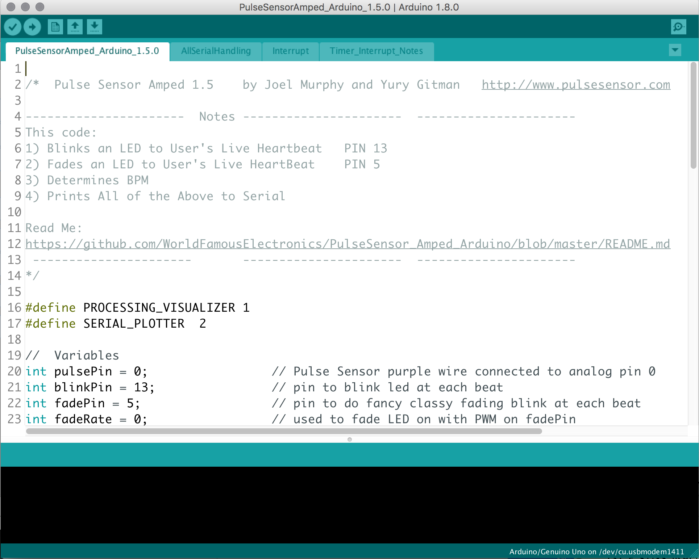
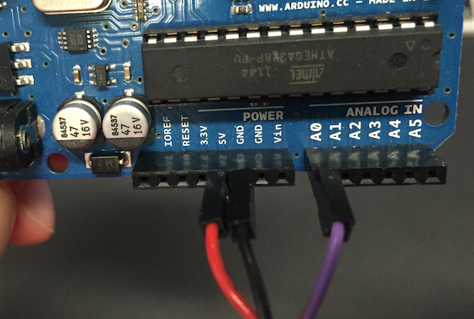
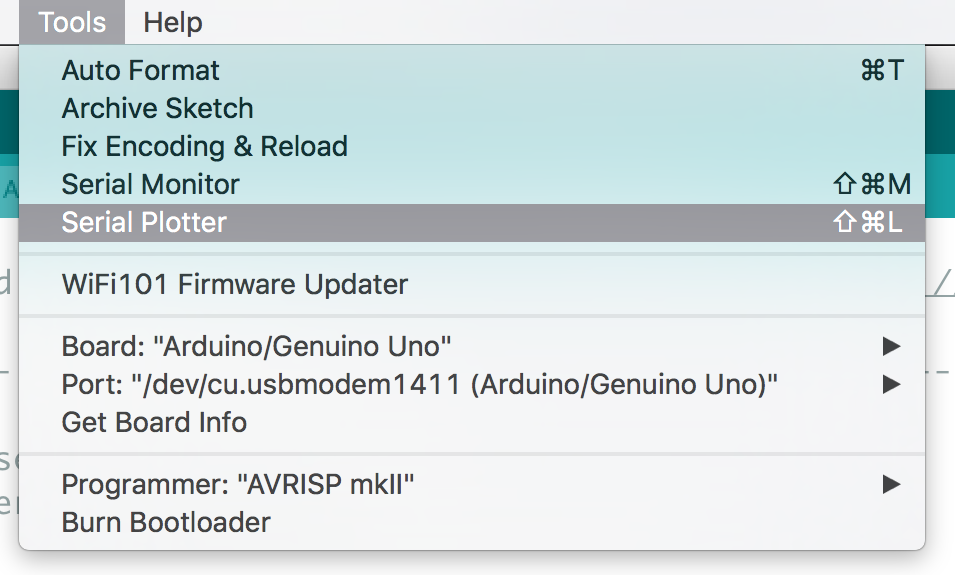
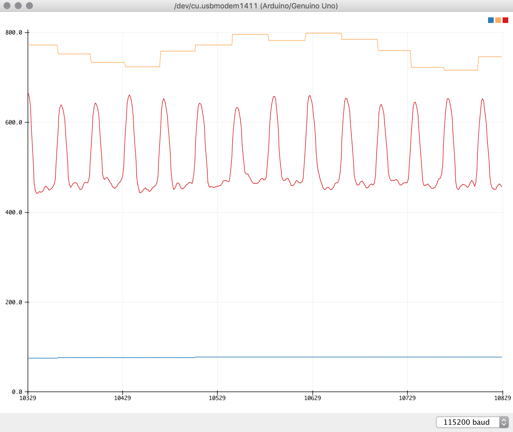
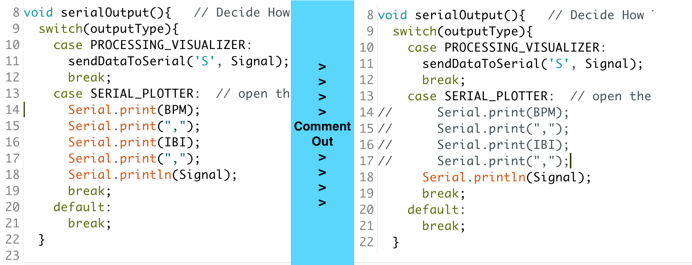
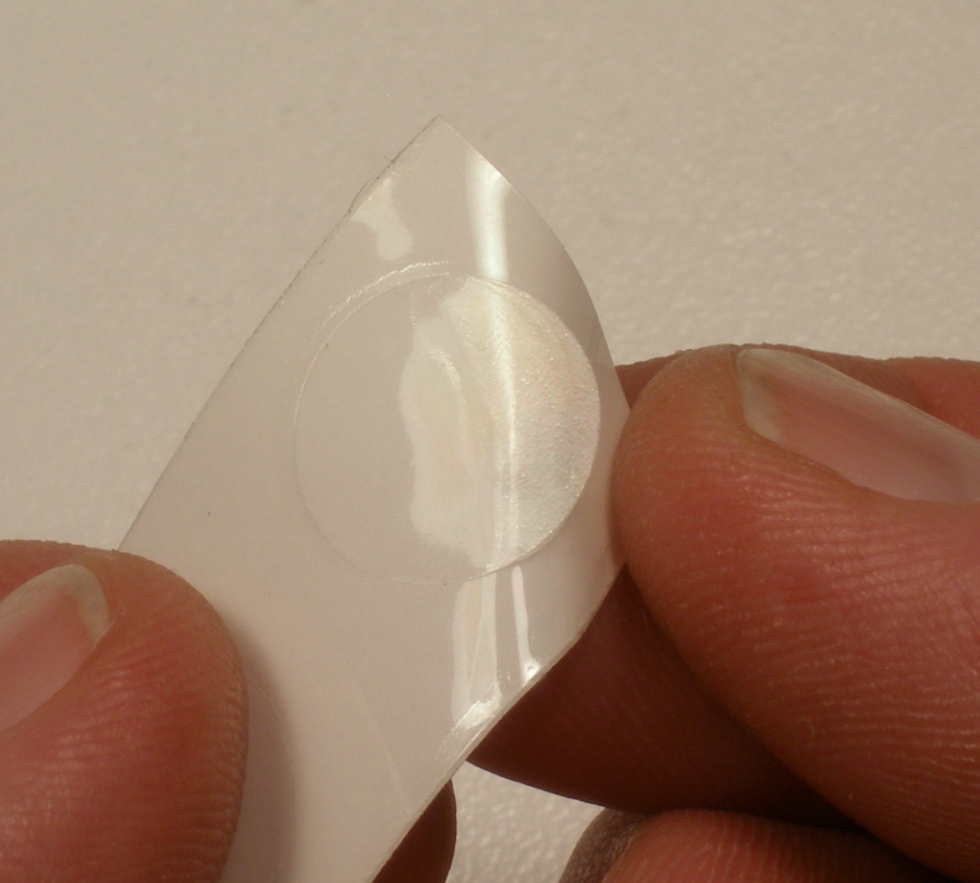
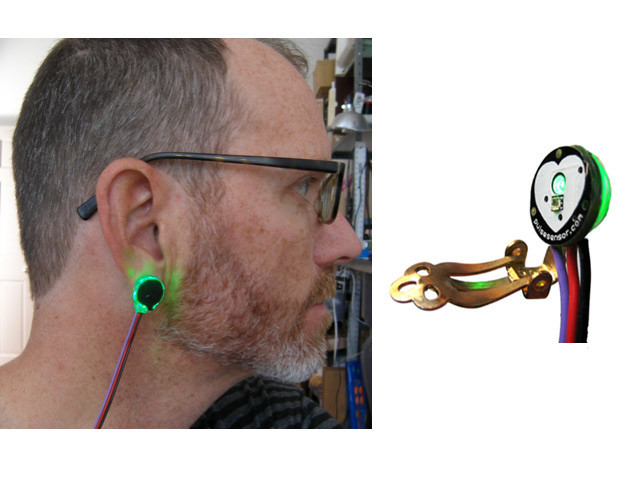

## Getting Advanced Code / <a href="http://www.pulsesensor.com">PulseSensor</a>  & <a href="http://arduino.cc/"> "Arduino"</a> 
* Blinks LED on Pin 13 to a User's Live Heartbeat.   
* "Fancy Fade Blink" an LED on Pin 5, to a User's Live HeartBeat.
* Calculates User's BPM, Beat-Per-Minute. 
* Calculates User's IBI, the Interval Between Beats.  
* Serial.print's the Signal, BPM, and IBI.  Use this output for our <a href="https://github.com/WorldFamousElectronics/PulseSensor_Amped_Processing_Visualizer">Processing Visualizer App</a> , our <a href="https://itunes.apple.com/us/app/pulse-sensor/id974284569?ls=1&mt=12"> Pulse Sensor Mac App</a>, or your project!  
* Tech Note:  Employ's Arduino's Interrupt, to keep "time", and calculate BPM and IBI.

## Screen Shot
 

## Installing
1. Click the `Clone or Download` button above and download the zip, or if you are a github user, clone this repo, or fork it! 
2. Take the **PulseSensor_Amped_Arduino-master.zip** file, and move it to your **Documents/Arduino** folder.
3. **Unzip** PulseSensor_Amped_Arduino-master.zip in your **Documents/Arduino** folder. **This properly installs your files.**
4. Double-click on **PulseSensorAmped_Arduino_1.5.0.ino** 

	**Or,** 0pen project in **Arduino via *File > Sketchbook > PulseSensor_Amped_Arduino-Master > PulseSensorAmped_Arduino_1.5.0.ino**
 

## Pulse Sensor Hook-up
Arduino Pin   | PulseSensor Cable Color
------------- | -------------
RED           | 5V or 3V   
BLACK         | GND (GROUND)
PURPLE        | A0 (Analog Pin Zero)

## Variables to Note
Variable Name     | What it does
------------------| -------------
Signal            | **Int** that holds raw Analog Input data on **Pin 0**, the PulseSensor's **Purple Cable**. It's updated every 2mS
BPM               | **Int** that holds the **heart-rate value**, derived every beat, from averaging **previous 10 IBI values** 
IBI               | **Int** that holds the **time interval between beats**
Pulse             | **Boolean** that is **true when a heartbeat is sensed**. It's **false** other times.  It **controls LED Pin 13**.
QS                | **Boolean** that is **true whenever Pulse is found and BPM** is updated. User must reset. 

## Working with other Apps via Serial.print
This Arduino Sketch works with:

* Our **Processing Sketch** <a href="https://github.com/WorldFamousElectronics/PulseSensor_Amped_Processing_Visualizer"> "Processing Visualizer"</a>
*  Our **Pulse Sensor Mac App** <a href="https://itunes.apple.com/us/app/pulse-sensor/id974284569?ls=1&mt=12"> "Pulse Sensor Mac App"</a>
*  The **Arduino Serial Plotter**

Follow the links above to learn more about the Processing Visualizer and Mac App. This Read Me will cover how to view your pulse wave and other data with the Arduino Serial Plotter. There is a variable in the Pulse Sensor Amped Arduino Sketch that determines how the serial output is formatted. The variable is called `outputType`, and there are two options for setting this variable: `PROCESSING_VISUALIZER` and `SERIAL_PLOTTER`. By default, `outputType` is set to `SERIAL_PLOTTER`. 

If you want to use the Serial Plotter, upload the Sketch to your Arduino microcontroller, and then select `Tools > Serial Plotter`.

When you turn on the Plotter, make sure that the baud rate is set to 115200. Make this adjustment with the lower right corner menu selector. You will see three traces in the Arduino Serial Plotter. The **red** trace is your pulse wave data from the `Signal` variable. The **yellow** trace is your `IBI`, or the time between each beat. The **blue** trace is your `BPM` or your Beats Per Minute. 

If you only want to see the pulse wave `Signal` data, then you can edit the Arduino Sketch. In the `AllSerialHandling.ino` tab, simply comment out the lines shown below by inserting `//` in the beginning of the line.

Now, when you run the Serial Plotter, you will see a **blue** pulse waveform only!

## Timer Interrupt Notes or "Why Do Some of PWM Pins Not Work ???"
There is a tab in the Arduino code called `Timer_Interrupt_Notes`. This page describes how to set up the timed interrupt depending on which hardware you are using, and what other things you may want to do with your sketch. We are using a hardware timer on the micrcontroller to make sure that our Pulse Sensor samples are taken at a consistent rate. That makes our data extra scientific! Please read it carefully!

PWM on pins 3 and 11 will not work when using this code, because we are using Timer 2!

## Timer Interrupts PWM Also 🤷‍♂️🤷‍♀️  
Interrupt Setting | DISABLES PWM ON DIGITAL PINS 
----------------- | -------------
TIMER1            |  3 AND 11  

## Pulse Sensor Preparation [ Garbage In ~ Garbage Out ]

It's important to protect the Pulse Sensor from the oils and sweat that your fingertips and earlobes and other body parts make. That stuff can adversely affect the signal quality. Also, it's important to protect **you** from the electricity that makes the Pulse Sensor work! To this end, we have provided clear vinyl stickers that fit perfectly on the face of the Pulse Sensor. Peel one off, and press it firmly on the **front** side of your Pulse Sensor.

## Ear-Clip or Finger-Strap Config

